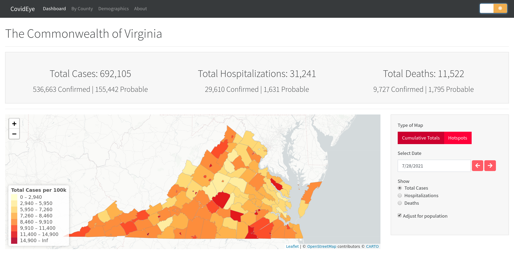

# CovidEye
CovidEye is an web application that displays COVID-19 data for the state of Virginia. It is designed to be as user friendly and feature-rich as possible while maintaining a streamlined appearance.

## Development
The project uses R shiny as the base framework. This allows us to maintain data-driven code in a convenient way with minimal custom JavaScript and CSS.

Each page is divided into a separate module, which is then divided further into sub-modules, allowing us to have an organized and readable codebase with reusable code.

If you want to contribute, either make a github issue or email rvanathanrowan@gmail.com with your suggestions before making a pull-request.

## Building
The stable website covideye.org doesn’t always have the most up-to-date features. To run the development version yourself clone the repo and open the project with RStudio. Then simply run `shiny::runApp()`. The first time this command is run will take some time to download the data.

To update the data, run `source(update.R)`. This will be done automatically if the data is over 24 hours old.

## Copying
This project is licensed under the GNU GPL version 3.0, see [LICENSE](./LICENSE).
